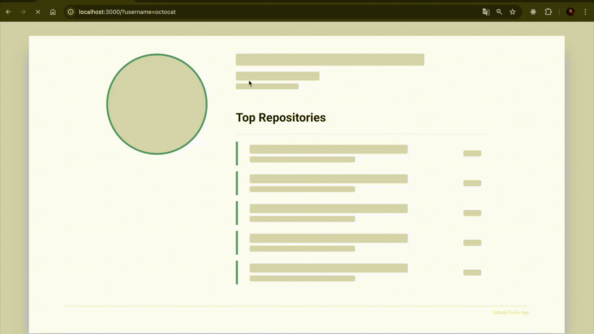

# GitHub Profile App Challenge

This is a solution for the **GitHub Profile App Challenge**, which aims to provide a user interface for searching and displaying GitHub user profiles using the GitHub REST API. This application enables users to retrieve and view essential details such as profile information and repositories for a given username.

## 🎯 Features



- **Profile Details**: Displays the user's profile picture, name, username, bio, and location.
- **Top Repositories**: Lists the top 5 repositories for the user, sorted by the number of stars in descending order.
- **Pixel-Perfect Design**: Follows the design specifications provided in the Figma file.
- **Dynamic Routing**: Allows users to directly access profiles through URLs with query parameters, e.g., `/?username=oskaralves`.
- **[EXTRA] Search Functionality**: Users can search for a GitHub profile by entering a username in an intuitive search bar with a button.

## 🚀 Tech Stack

- **Framework**: [Next.js 15](https://nextjs.org/) with the latest React 19.
- **State Management**: [React Query](https://tanstack.com/query/v5) for efficient and cache-friendly API data fetching.
- **HTTP Client**: [Axios](https://axios-http.com/) for API requests.
- **Styling**: [Tailwind CSS](https://tailwindcss.com/) for responsive and modern styling.
- **Icons**: [Lucide React](https://lucide.dev/) for crisp, scalable icons.

## 📦 Installation

Clone this repository and navigate to the project folder:

```bash
git clone https://github.com/oskaralves/github-profile-app-challenge.git
cd github-profile-app-challenge
```

Install the dependencies using **Yarn**:

```bash
yarn install
```

## 🛠️ Running the Application

To start the development server:

```bash
yarn dev
```

Navigate to `http://localhost:3000` to view the application.

To build the application for production:

```bash
yarn build
```

Start the production server:

```bash
yarn start
```

## ⚙️ Usage

1. Enter a GitHub username in the search input and click the **Search** button.
2. The application fetches and displays the following information for the username:
   - Profile picture
   - Full name
   - Username
   - Bio
   - Top 5 repositories by star count
3. Alternatively, you can access a profile directly via the URL by appending `?username=<github-username>`.

## 🌟 Highlights

- **Input with Search Button**: Provides a user-friendly way to input and fetch profiles, enhancing the default URL-based navigation.
- **Error Handling**: Displays meaningful messages for scenarios like "No profile found" or "No repositories found."
- **Performance Optimizations**: Leveraged React Query for API request caching and retries, ensuring optimal performance and responsiveness.

## 🧑‍🎨 Design

The project follows the design specifications provided in the [Figma file](https://www.figma.com/file/Z4Ys41h6WcE49nCBebKT3N/Programming-Challenge---Frontend). The UI is implemented with a focus on being pixel-perfect.

## 🛡️ Evaluation Criteria

- **Architectural Decisions**: Designed with a scalable structure using Next.js 15 and React 19.
- **Project Structure**: Organized code and folder hierarchy for maintainability.
- **Error Handling**: Managed API errors and edge cases gracefully.
- **Responsiveness**: Fully responsive and styled with Tailwind CSS.
- **Best Practices**: Followed clean code principles and linting standards.
